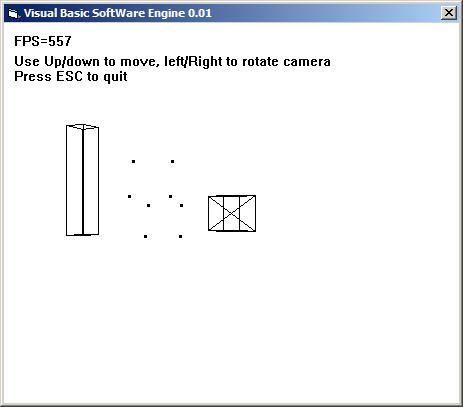



## Pure VB SoftWare 3D Engine programming series part 1:Matrix and transformations

### Description

This code shows how to begin software 3D Renderer using pure Visual Basic NO DirectX or OpenGL, this code is for educationnal Purpose.

It shows how to Do Matrix computations and transformation.

-How to project a 3D point to the screen

-How to do DoubleBuffering

-How to Design and Use First Person shooter Camera

All the rendering pipeline is coded in Pure VB.

Note that all the code is documented.

So leave feedbacks

If you want to use ready to Use 3D engine built over DirectX or OpenGl in Visual basic, i advide you NemoX 3D engine.

here is a link

http://perso.numericable.fr/~gazkole/malakoff/index.htm
 
### More Info
 

             |
---                |---
**Submitted On**   |2005-12-03 00:40:04
**By**             |[polaris](https://github.com/Planet-Source-Code/PSCIndex/blob/master/ByAuthor/polaris.md)
**Level**          |Intermediate
**User Rating**    |5.0 (15 globes from 3 users)
**Compatibility**  |VB 4\.0 \(32\-bit\), VB 5\.0, VB 6\.0
**Category**       |[Coding Standards](https://github.com/Planet-Source-Code/PSCIndex/blob/master/ByCategory/coding-standards__1-43.md)
**World**          |[Visual Basic](https://github.com/Planet-Source-Code/PSCIndex/blob/master/ByWorld/visual-basic.md)
**Archive File**   |[Pure\_VB\_So1953271232005\.zip](https://github.com/Planet-Source-Code/polaris-pure-vb-software-3d-engine-programming-series-part-1-matrix-and-transformations__1-63466/archive/master.zip)

### API Declarations

Some

